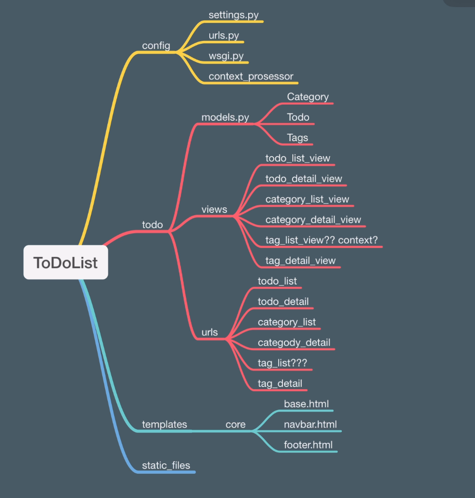

# **Django** Proje2:
## TODO List Projesi

### Projenin Amaçları:
* Model Yapısını Anlamak
* Django ORM Query ile Çalışmak
* MVT İlişkisini Anlamak
* Django Shell Kullanımını Anlamak
* Django Shell'de Query Kullanımı
* OneToOneField, ForeignKey ve ManyToManyField Yapılarını Anlamak
* Context Prosessor ile Genel Verileri Site içerisinde Kullanmak
* DEBUG Mode
* Settings Dosyasını Daha Fazla Tanımak



## Django ORM Query:
```shell
python manage.py shell
```

```python
# Todo Modelini import etmek:
from todo.models import Todo

# Tum Objeler:
Todo.objects.all()

# Tum objeleri say:
Todo.objects.all().count()

# Yeni Todo olusturmak:
Todo.objects.create(title="Shell Uzerinden Olusturulan Todo")
Todo.objects.create(title="Shell Uzerinden Yeni Olusturulan Todo", is_active=True)

# is_active olanlari goster
Todo.objects.filter(is_active=True)  # SELECT * FROM todo WHERE is_active=True

# is_active olanlari say:
Todo.objects.filter(is_active=True).count()

# UPDATE:
# Yapilan sorguya uyan objelerin istenilen alanlari degistirilebilir..
Todo.objects.filter(is_active=False).update(is_active=True)

# Title icinde Django gecmeyenleri bul ve Django ekle
todos = Todo.objects.exclude(title__icontains="django")

for item in todos:
    item.title = f"{item.title} - Django"
    item.save()
```